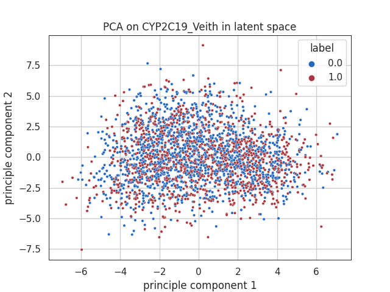
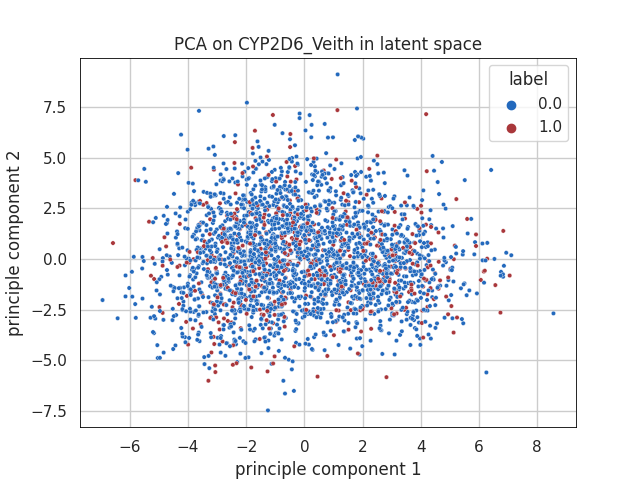
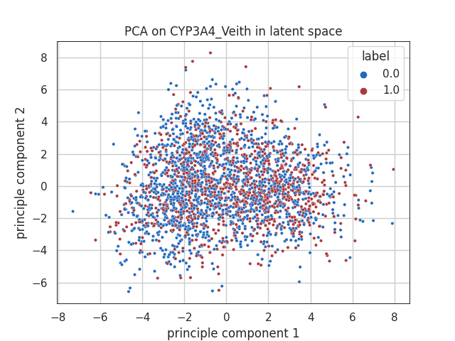
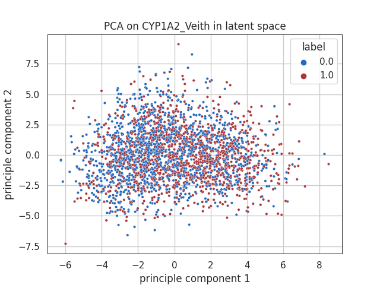
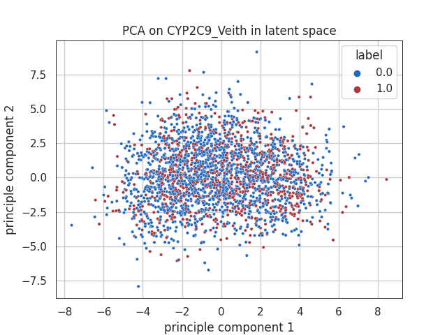
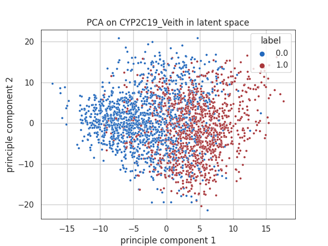
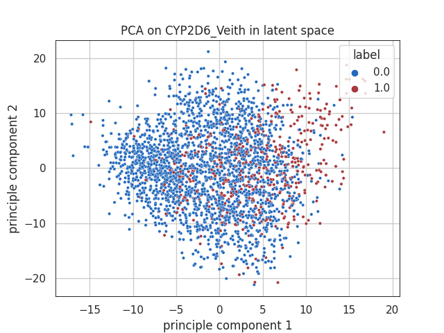
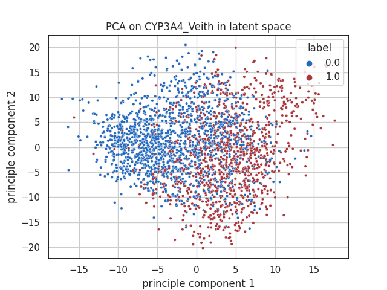
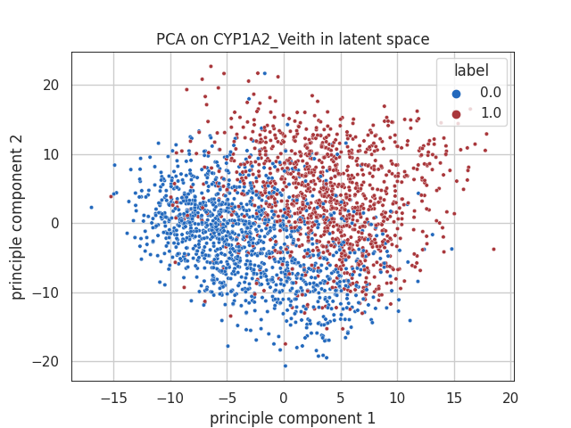
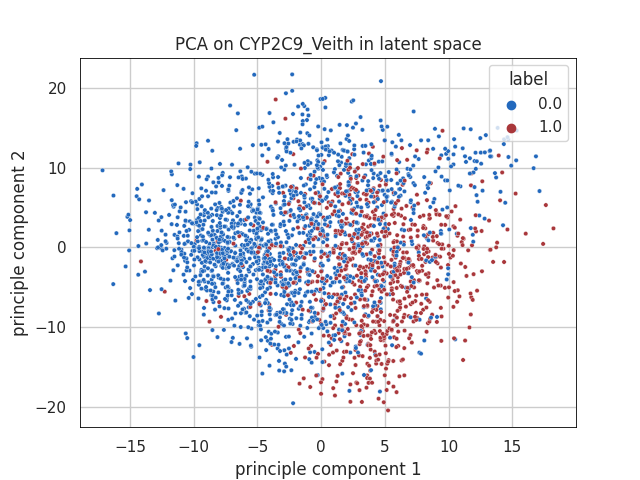

RNN VAE latent space visualization, 5 Metabolism tasks were trained simultaneously
 
 | PCA | CYP2C19   |  CYP2D6  | CYP3A4| CYP1A2 | CYP2C9
:-----:|:-------------------------:|:-------------------------:|:-------------------------:|:-------------------------:|:-------------------------:
|latent space during training|  |  |   |  |  
|Epoch 0|  |  |   |  |  
|Epoch 74|  |  |   |  |  
